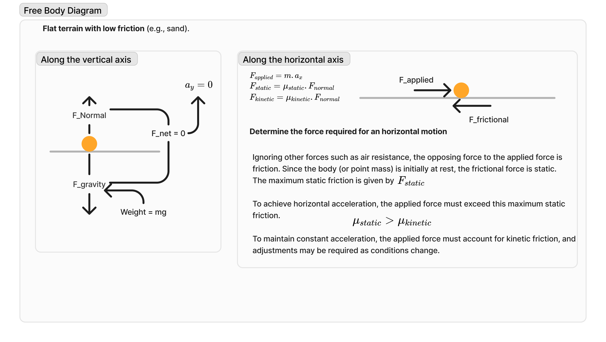

### Task: Simulate Rover Traversal on Varied Terrain

### Objective

Design and simulate a rover navigating a path with:

1. **Flat terrain with low friction** (e.g., sand).
    
2. **Steep incline (45°) with moderate friction** (e.g., rocky terrain).
3. **Flat terrain with high friction** (e.g., asphalt).

### Integration

- **Newton’s Laws of Motion**: Acceleration and deceleration.
- **Kinematics**: Displacement, velocity, and trajectory analysis.
- **Friction**: Varying terrain resistances.
- **Inclined Plane Dynamics**: Torque and stability on slopes.
- **Forces on Rigid Bodies**: Chassis load analysis.
