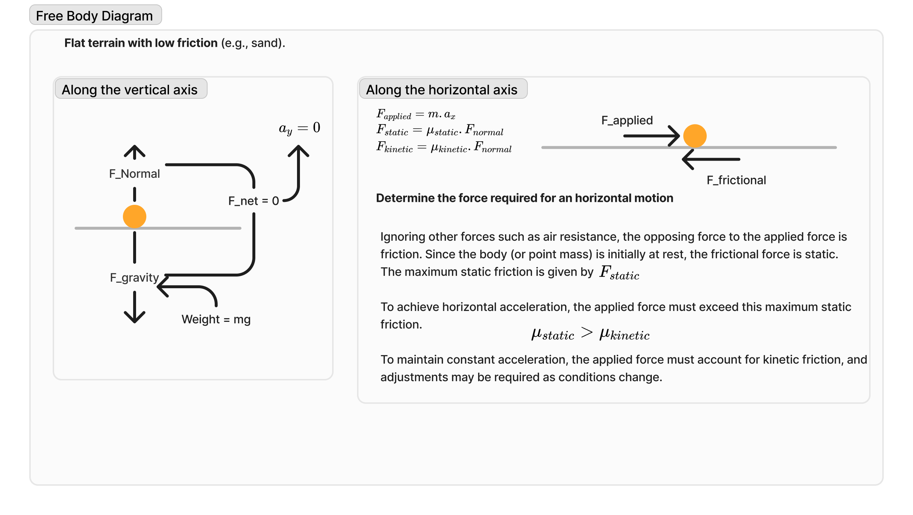
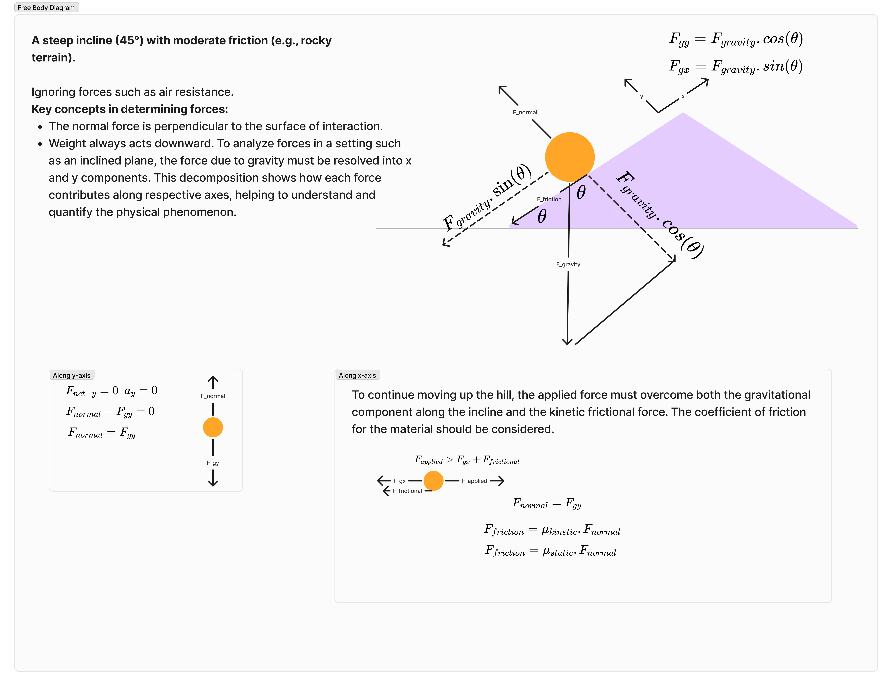
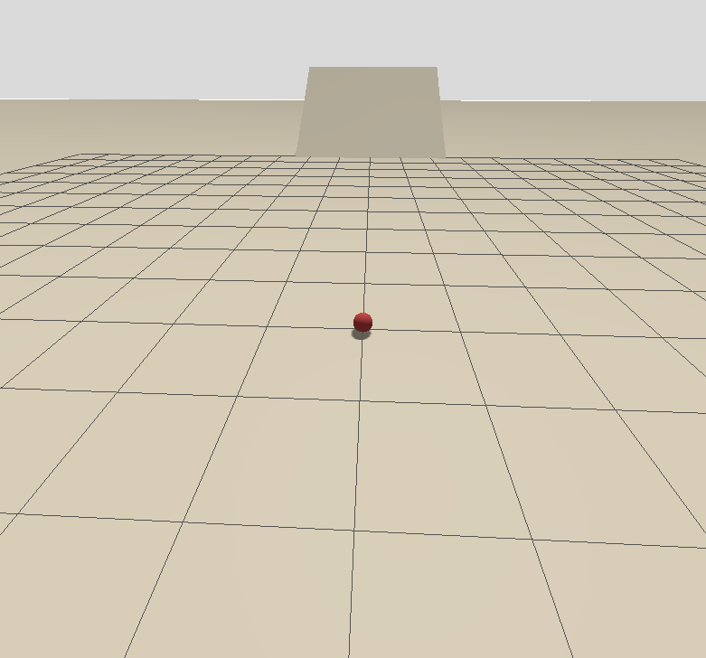

## Task: Simulate Rover Traversal on Varied Terrain

### Objective

Design and simulate a rover navigating through different terrain conditions.

#### Scenario 1: Low Friction Terrain
- **Surface**: Flat terrain with low friction (sandy surface)
    <a href="resources/images/fbd/flat_terrain.png" data-fancybox="terrain-images" data-title="Free Body Diagram - Flat Terrain">
        
    </a>

#### Scenario 2: Inclined Terrain
- **Surface**: 45° incline with moderate friction (rocky surface)
    <a href="resources/images/fbd/inclined_terrain.png" data-fancybox="terrain-images" data-title="Free Body Diagram - Inclined Terrain">
        
    </a>

### Implementation Details
#### Simulation Setup
- Point mass representation of rover
- Gazebo standalone simulation (gz-sim v9)
- Custom model plugin for force application and verification
- Mass: 20 kg
- Surface properties:
  - Ground: μ = 0.3 (sand)
  - Incline: μ = 0.3, angle = 30° (-0.5235987756 rad)


#### Task world
<a href="resources/images/simulation/task-world.png" data-fancybox="terrain-images" data-title="Task World">
    
</a>
### Simulation Results

1. Flat terrain
    1. Insufficient Force Test
    ```log
    [Phase 0]
    Applied Force: 29.43 N
    Position: 0.1166 0.0 0.1 m
    Velocity: 1.1054 0.0 -0.0000000366 m/s
    ❌ Moving with insufficient force.
    ```
    2. Sufficient Force Test
    ```log
    [Phase 1]
    Applied Force: 58.86 N
    Position: 0.8386 0.0 0.1 m
    Velocity: 0.9069 0.0 -0.0000000033 m/s
    ✅ Moving correctly with sufficient force.
    ```

2. Incline terrain
    1. Insufficient Force Test
    ```log
    [Phase 0]
    Applied Force: 111.692 N
    Position: 5.9633 0.0 0.240999 m
    Velocity: 3.71986 0.0 2.14882 m/s
    Distance to incline: 4.0367 m
    Reached incline: No
    ❌ Moving with insufficient force!
    ✅ Correctly unable to climb incline with insufficient force.
    ```

    ```log
    [Phase 0]
    Applied Force: 111.692 N
    Position: 7.99245 0.0 1.41345 m
    Velocity: 1.57182 0.0 0.908648 m/s
    Distance to incline: 2.00755 m
    Reached incline: No
    ❌ Moving with insufficient force!
    ✅ Correctly unable to climb incline with insufficient force.
    ```
    2. Sufficient Force Test
    ```log
    [Phase 1]
    Applied Force: 200.0 N
    Position: 10.5023 0.0 2.89132 m
    Velocity: 2.85721 0.0 1.65012 m/s
    Distance to incline: -0.5023 m
    Reached incline: Yes
    ✅ Successfully climbed incline with sufficient force.
    ```


### Known Issues
1. Physics Behavior
   - Small forces (< μN) causing unintended motion
   - Contact dynamics configuration needs tuning
   - Physics step size effects present

### Physics Concepts Applied
1. **Newton's Laws of Motion**
2. **Kinematics**
   - Displacement calculation
   - Velocity
   - Trajectory analysis
3. **Friction Analysis**
    - Static/Dynamic friction
    - Surface interactions
4. **Inclined Plane Dynamics**
   - Force analysis
   - Stability assessment
5. **Forces on Rigid Bodies**
   - Component forces
   - Critical angle analysis
